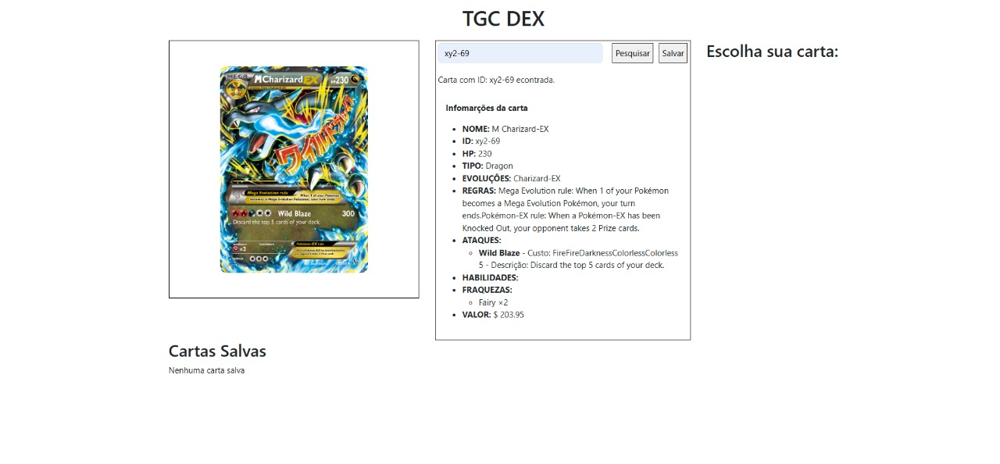
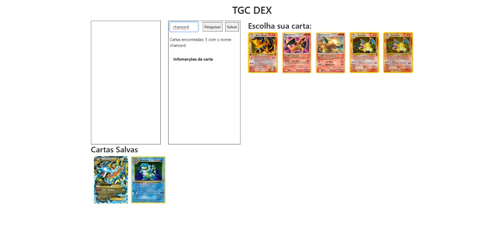
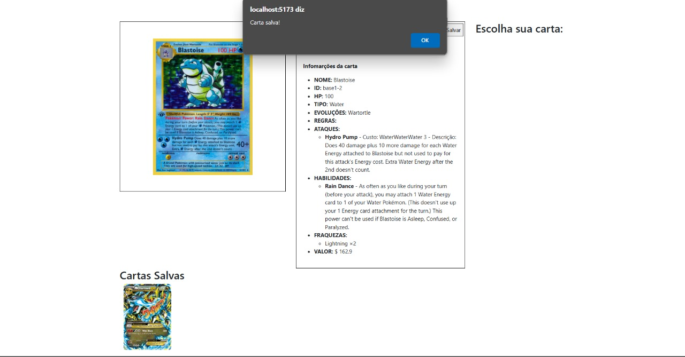

/**
 * Nome do arquivo: README.MD
 * Data de criação: 15/05/2025
 * Autor: Matheus Alencar Cavalcante
 * Matrícula: 01568969
 **/

 # 1º COMMIT 
 Arquivos iniciais, mais a matricula

 # 2º COMMIT
 Criação e organização de arquivos... import bootstrap e layout

 # 3º COMMIT
 Finalização da Dashboard e estilização

 # 4º COMMIT
 Criação da aba de pesquisa com resultado de sucesso ou invalido de acordo com ID 

 # 5º CONMIT
 Imagem aparece de acordo com ID digitado

 # 6º COMMIT
 Exibição das informações e imagem da carta de acordo com a ID digitada

 # 7º COMMIT
 Criação do Layout das cartas salvas, indentação do codigo e ajuste do css

 # 8º COMMIT
 Buscar por nomes (console e no layout), correção de bugs e organização do estilo css

 # IMAGENS DO PROJETO

 